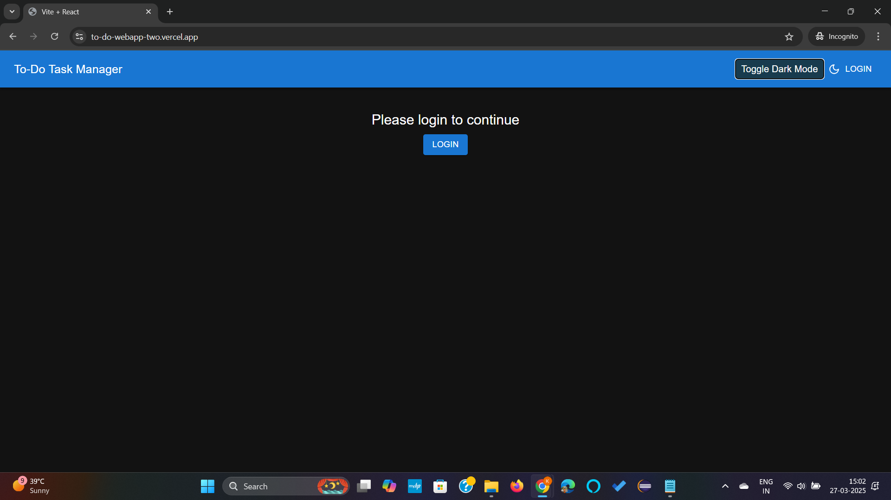
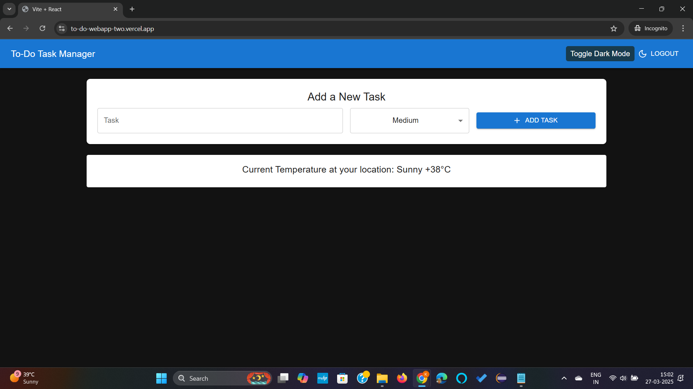
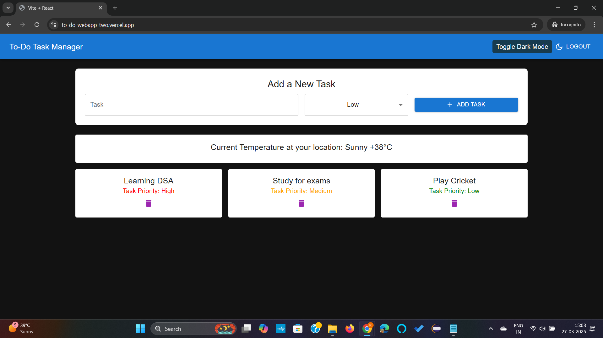

# To-Do Web App

A simple and efficient To-Do Web Application to help users manage their daily tasks effectively.

## Live Demo
Check out the live version of the app here: [To-Do WebApp](https://to-do-webapp-two.vercel.app/)

## Repository
The source code is available on GitHub: [To-Do WebApp Repository](https://github.com/krunal-sukhade/to-do-webapp)


## Installation
To run the project locally, follow these steps:

1. Clone the repository:
   ```sh
   git clone https://github.com/krunal-sukhade/to-do-webapp.git
   ```
2. Navigate to the project directory:
   ```sh
   cd to-do-webapp
   ```
3. Install dependencies:
   ```sh
   npm install
   ```
4. Start the development server:
   ```sh
   npm run dev
   ```
5. Open the app in your browser at `http://localhost:5173`

## Contributing
Contributions are welcome! To contribute:
1. Fork the repository.
2. Create a new branch (`git checkout -b feature-branch`).
3. Commit your changes (`git commit -m "Added new feature"`).
4. Push to your branch (`git push origin feature-branch`).
5. Create a Pull Request.

## Requirements

### Frontend Development and API Integration:
- Utilize HTML to structure the application's layout.
- Use CSS for styling the application (Bootstrap or Material-UI is allowed).
- Implement JavaScript (ES6+).
- Integrate with a public API (e.g., a weather API) to display relevant data for tasks.
- Implement error handling for API requests.

### React Components and Advanced State Management:
- Use functional components and React hooks (`useState`, `useEffect`).
- Implement at least two components:
  - **TaskInput**: Component for adding tasks.
  - **TaskList**: Component for displaying tasks.
- Use Redux Thunk or Redux Saga for handling asynchronous actions (API calls).

### Responsive Design:
- Ensure the application is fully responsive across mobile, tablet, and desktop devices.
- Use CSS Grid and Flexbox for layout.
- Implement a mobile-first design approach.

### Functionality:
- **Add Task**: Users can input and add tasks.
- **View Tasks**: Display all added tasks.
- **Delete Task**: Allow users to remove tasks.
- **Task Prioritization**: Set and display task priorities (High, Medium, Low).
- **Persistent Storage**: Use local/session storage for data persistence.

### User Authentication:
- Simulate login/logout functionality using Redux.
- Protect the To-Do list so only logged-in users can access tasks.


## Screenshots

### Home Page:



### Add Task:



### List Tasks:


## License
This project is licensed under the MIT License.

## Contact
For any questions or feedback, feel free to reach out:
- GitHub: [krunal-sukhade](https://github.com/krunal-sukhade)

